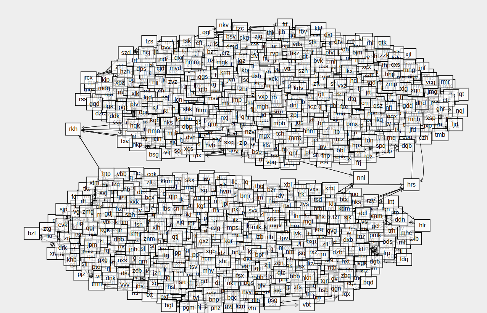

# aoc-2023

My solutions for [Advent of Code 2023](https://adventofcode.com/2023), mostly in Python 3.

## Execution times

All code in Python/[Codon](https://docs.exaloop.io/codon), some days also in Rust.

* Python: 3.12 - `python3 run_python.py`
* Codon: 0.16.3 - `python3 run_codon.py`
* Rust: 1.74.1 - `cargo run --release`

| Day    | Python   | Codon   | Rust   |
|--------|----------|---------|--------|
| Day 1  | 76.7ms   | 23.2ms  |        |
| Day 2  | 28.2ms   | 4.0ms   |        |
| Day 3  | 68.7ms   | 8.2ms   |        |
| Day 4  | 36.5ms   | 5.4ms   |        |
| Day 5  | ?        | 4.7s    |        |
| Day 6  | 3.0s     | 363.9ms | 21.3ms |
| Day 7  | 50.5ms   | 12.0ms  |        |
| Day 8  | 144.2ms  | -       |        |
| Day 9  | 40.4ms   | 5.0ms   | 505µs  |
| Day 10 | 80.6ms   | 13.5ms  |        |
| Day 11 | 1.2s     | 89.0ms  |        |
| Day 12 | 400.3ms  | -       |        |
| Day 13 | 286.5ms  | 35.9ms  |        |
| Day 14 | 4392.7ms | 390.7ms |        |
| Day 15 | 51.8ms   | 4.5ms   | 590µs  |
| Day 16 | 2.5s     | 516.9ms |        |
| Day 17 | 4.3s     | -       |        |
| Day 18 | 45.1ms   | 3.1ms   |        |
| Day 19 | 58.8ms   | -       |        |
| Day 20 | 453.5ms  | -       |        |
| Day 21 | 148.4ms  | 27.5ms  |        |
| Day 22 | ?        | 79.8s   |        |
| Day 23 | ?        | 14.5s   |        |
| Day 24 | 846.5ms  | -       |        |
| Day 25 | 203.4ms  | -       |        |

Ranking for all 50 stars: 2871st place

Learned along the way: **Rust!**. See `rust-aoc/src/learn.rs` and Rust days.

## Daily notes

**Day 1: Trebuchet?!**

* Topics: String search
* Challenge: Find numbers in a string

Part 1 was straightforward, but I wanted to reduce part 2 to re-use the solution from part 1, replacing numbers in
strings. Somehow I misread part 2 for cases like `twone` and implemented something that wouldn't work, then switched to
the direct recognition of numbers as strings.

**Day 2: Cube Conundrum**

* Topics: -
* Challenge: Finding highest/lowest numbers

**Day 3: Gear Ratios**

* Topics: -
* Challenge: Finding numbers in a grid

A little tricky to find neighbors of variable-length numbers in an upper/lower line.
Part 2 required to save gear (`*`) positions to later calculate the result

**Day 4: Scratchcards**

* Topics: Memoization?
* Challenge: Find winning scratchcards

The first puzzle which required implementing a somewhat fancier part 2, as the naive approach wouldn't work.

**Day 5: If You Give A Seed A Fertilizer**

* Topics: Mapping functions, Number ranges
* Challenge: Find the lowest number after combining several mapping functions

Long read for part 1, but implementation was pretty quick.

Naive approach for part 2 would take around 90s, reversing it and start from the lowest location brought it down to
around 5s. There would be a much faster, but much more tedious to implement approach of splitting incoming number
ranges, but I didn't implement that.

**Day 6: Wait For It**

* Topics: Linear equation, [Quadratic formula](https://en.wikipedia.org/wiki/Quadratic_formula)
* Challenge: Check possible winning number combinations

Re-used solution from part 1 for part 2 which runs in about 20ms (hello, Rust!). There would be an elegant mathematical
solution by using the quadratic formula.

**Day 7: Camel Cards**

* Topics: [Combination](https://en.wikipedia.org/wiki/Combination)
* Challenge: Determine quality of hands in a poker-like game

Really liked this puzzle. Used hexadecimal to represent Ace, King, Queen, Jack, Ten as values and an elegant method for
n-tuples (pairs, three of a kind etc.). Used `itertools.combinations_with_replacement` to check replacement against
cards already in hand, which I was happy with (but not needed, as the most-appearing card in the hand could be used).

**Day 8: Haunted Wasteland**

* Topics: Graph, cycle detection, [LCM](https://en.wikipedia.org/wiki/Least_common_multiple)
* Challenge: Follow nodes in a given left/right pattern

Short and sweet. Prepared a `Node`-class for part 1 where I could `.move()` on a node and get the next one, and for part
2 it was LCM again, as the input was prepared to have nice and clean cycles.

**Day 9: Mirage Maintenance**

* Topics: -
* Challenge: Summing differences

Noticed that I could just add up the rightmost numbers on the triangle to get the next number.
Part 2 was a bit trickier as I needed to alternate between adding and subtracting, but it worked the same way.

**Day 10: Pipe Maze**

* Topics: [Flood filll](https://en.wikipedia.org/wiki/Flood_fill)
* Challenge: Find the
  TODO

Really liked this puzzle. Part 2 was tricky to find what was "inside" of the loop, and I used the directionality of the
loop which has to be either clockwise or counter-clockwise. Walking along the loop on a clockwise loop, one can mark all
tiles on the right, because they have to be inside the loop.

**Day 11: Cosmic Expansion**

* Topics: -
* Challenge: Distance counting

I generalized my part 1 solution for part 2 to count for "expanded" rows and cols.

**Day 12: Hot Springs**

* Topics: [Recursion](https://en.wikipedia.org/wiki/Recursion), [Memoization](https://en.wikipedia.org/wiki/Memoization)
* Challenge: Find number of possible placings

This one was hard - and fun!

For Dynamic Programming problems, it can be useful to memoize function results. Especially for recursive functions, it
means that a whole branch can be skipped, as we can look up the result (if we calculated it already before).

```python
@functools.cache
def place_next(state: str, groups) -> int:
    ...
```

Note: `list`s can not be used as function parameters, but they can be converted to `tuple()`.

**Day 13: Point of Incidence**

* Topics: -
* Challenge: Find the row/col of mirroring

Brute forced part 2, realized later that it would easy to check for near-perfect mirrors, but brute-forcing was already
fast enough.

**Day 14: Parabolic Reflector Dish**

* Topics: Simulation
* Challenge: Find reflection lines in grid

Simulating rolling boulders for part 1 turned into a fun cycle detection for part 2, requiring storing the grid first to
check if we had a repetition. I first only stored the number which wasn't enough, but working with states worked out
fine.

**Day 15: Lens Library**

* Topics: [Hash map](https://en.wikipedia.org/wiki/Hash_table)
* Challenge: Implement a custom hash function and then a Hash map

For both parts following the instructions and implementing them was enough.

**Day 16: The Floor Will Be Lava**

* Topics: Simulation, cycle detection
* Challenge: Simulate beams of light over a grid

Nice puzzle, similar to a game with light beams. Expected a more different part 2, but it was pretty much part 1 inside
a loop.

**Day 17: Clumsy Crucible**

* Topics: Path
  finding, [Dijkstra](https://en.wikipedia.org/wiki/Dijkstra%27s_algorithm), [Binary search](https://en.wikipedia.org/wiki/Binary_search_algorithm)
* Challenge: Find the shortest path on a weighted graph

First tried a recursive DFS and then a simple BFS which were both far too slow, so I started on implementing Dijkstra.
Had to wrap my head around adding the additional constraints, but it turned out adding the "straight"-parameter (how
many straight moves since last turn) to check if a node was visited was enough.

As an implementation detail, `heapq` is roughly 2x as fast as `queue.PriorityQueue`, I assume due to the faster
inserting.

**Day 18: Lavaduct Lagoon**

* Topics: Area calculation, [Shoelace forumla](https://en.wikipedia.org/wiki/Shoelace_formula)
* Challenge: Calculate area given the edge coordinates

Only getting to this day later, I was already spoilered by Reddit-posts that the dimensions for part 2 would be huge, so
I skipped flood-filling completely and directly read about the Shoelace formula, which was a nice thing to learn.

**Day 19: Aplenty**

* Topics: Number ranges
* Challenge: Check if parts satisfy a number of conditions based on properties

Fun puzzle, but after figuring out part 2 (exploring all branches & working with ranges), I had some off-by-one errors
which took time to spot.

**Day 20: Pulse Propagation**

* Topics: Simulation, cycle detection, LCM, logic gates
* Challenge: Simulate

The main difficulty for part 1 was understanding the details of the modules and implementing, so they would match the
requirements. After clearing out some bugs this worked out nice. For part 2, once again cycle detection and LCM for some
critical modules (which the input was deliberately designed for) which worked surprisingly well.

**Day 21: Step Counter**

* Topics: Pathfinding, Quadratic fit
* Challenge: Find number of walkable paths after n steps

Found part 2 one of the hardest challenges this year. I spotted the quadratic nature of expansion quite early but didn't
think it was an exact function, also due to some off-by-one errors.

**Day 22: Sand Slabs**

* Topics: Simulation, Graph
* Challenge: Find out which bricks support others in a tower

As I already had the code to simulate "gravity" (bricks falling down) I took the easy way of removing a brick and check
if something moves, which was slow (~2 minutes) but worked for both parts.

**Day 23: A Long Walk**

* Topics: Graph, Pathfinding, DFS
* Challenge: Find the _longest_ route between top left and bottom right without visiting the same spot twice.

Solved part 1 quickly using a recursive approach, only recursing on junctions. Realized early that the grid can be
reduced to a graph for part 2 to solve it more efficiently, but let the solver from part 1 run for a bit, and it spit
out the answer after 2h. I liked how the twist from part 2 makes it a completely different problem.

Implemented the minimal graph by contracting the nodes later and brought down runtime to around 20s.

**Day 24: Day 24: Never Tell Me The Odds**

* Topics: [Equation solving](https://docs.sympy.org/latest/guides/solving/index.html)
* Challenge: Find line intersections in 2d and 3d

Part 1 was fun but a little bit tricky to make sure the "time" was positive. For part 2 I initially thought I could
solve it with a system of linear equations, but then switched to Sympy to solve it.

**Day 25: Snowverload**

* Topics:
  Graphs, [Minimum cut](https://en.wikipedia.org/wiki/Minimum_cut), [Dijkstra](https://en.wikipedia.org/wiki/Dijkstra%27s_algorithm)
* Challenge: Cutting edges to create two subgraphs

Noticed in the example that some nodes form triangles, thus forming a "strong bond", and tried only cutting weak
connections. Unfortunately this didn't scale for the real input. Used [dagitty](https://www.dagitty.net/dags.html) to
solve it graphically and only afterwards learned about "Minimum cut" algorithms. Then took the simplified approach of
randomly selecting 2 nodes (50% chance that they are in different subgraphs) and removing 3 paths between them, which
would also remove the 3 critical edges. Idea
from [Reddit](https://www.reddit.com/r/adventofcode/comments/18qbsxs/comment/keus9ps/), based on Edmonds-Karp but not
actually implementing it.




